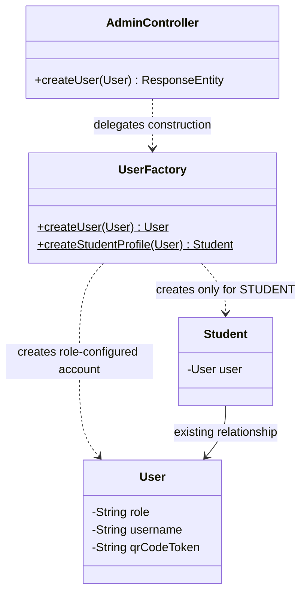
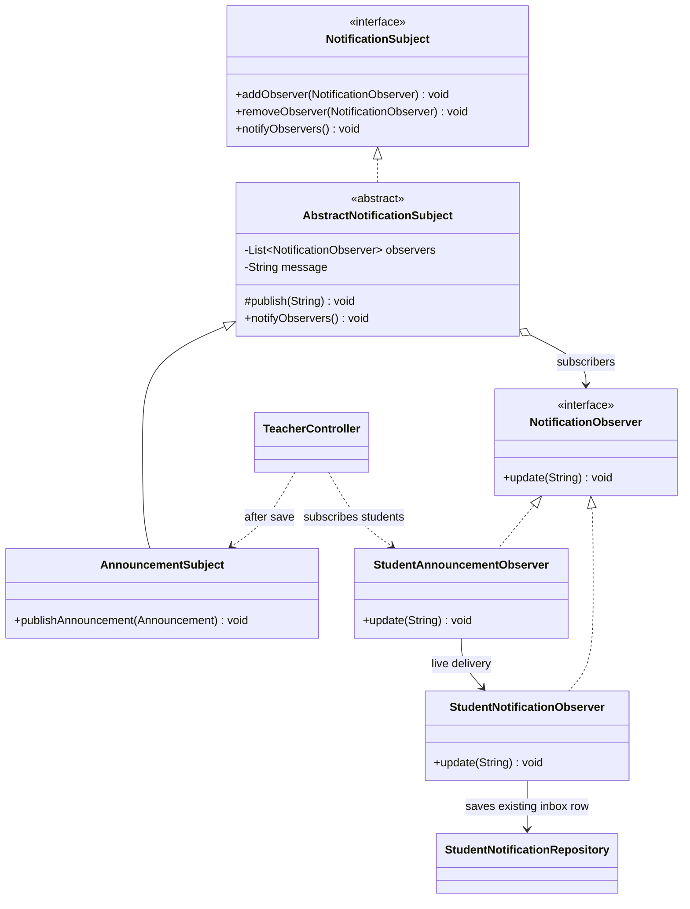
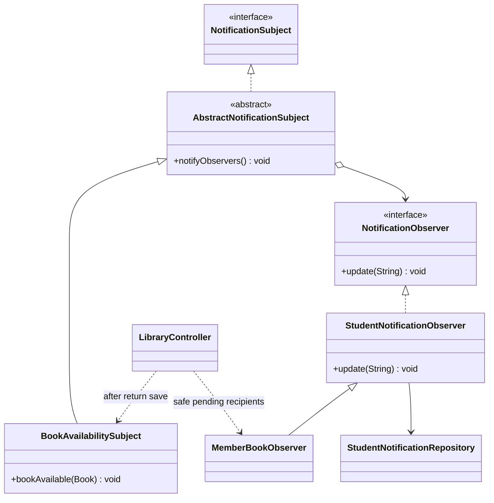
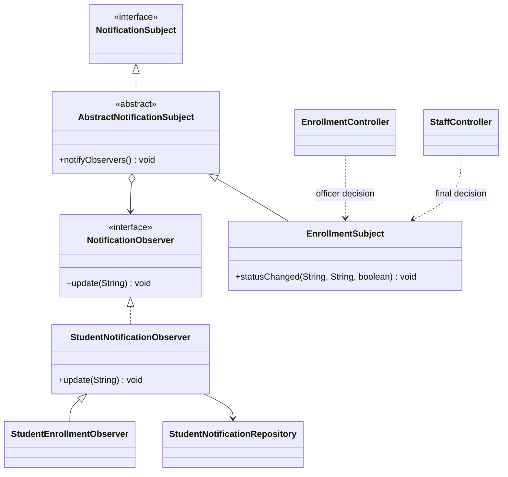
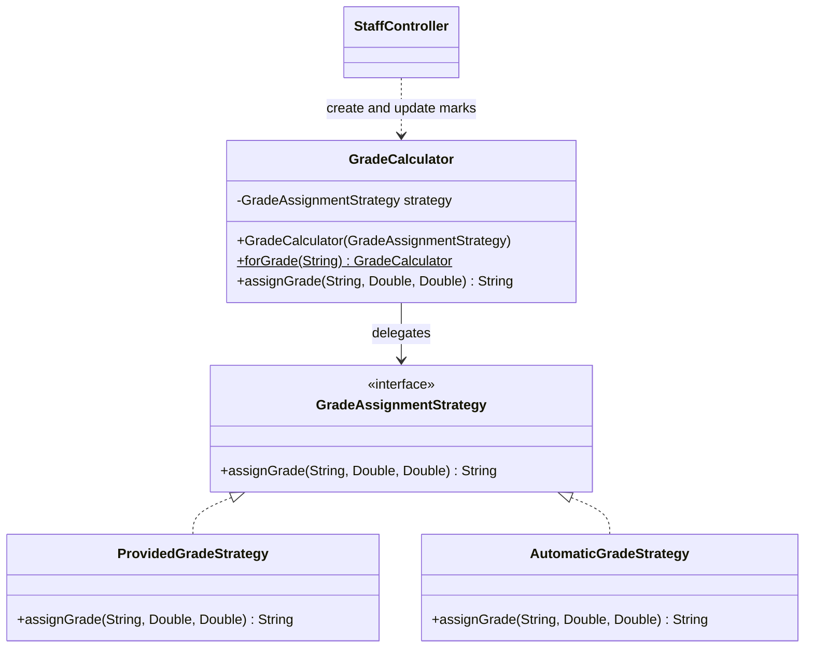
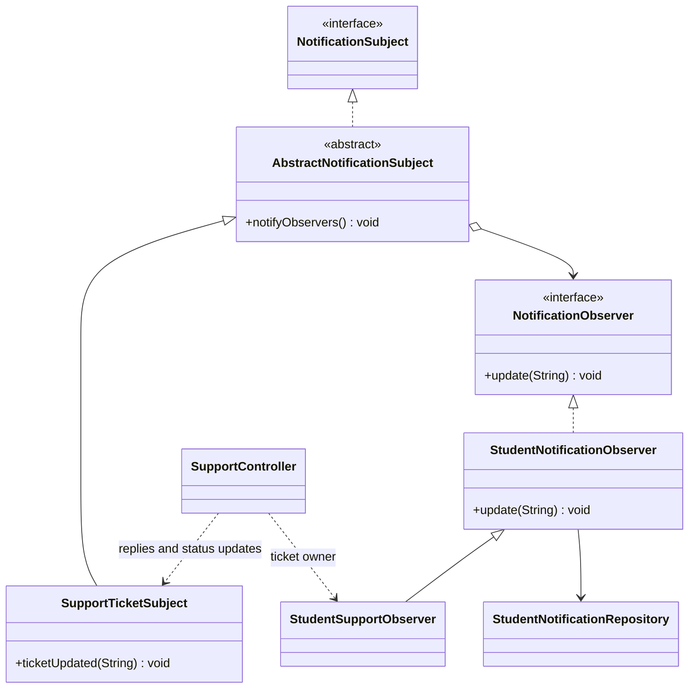

# School360 design patterns implementation

Implemented on 6 October 2026. This report describes the actual integrated code, not a standalone demonstration.

## Implementation summary

| Management | Pattern | Problem solved | Classes used |
|---|---|---|---|
| Student & User | Simple Factory | Centralize role-configured account creation and student-only profile construction | UserFactory, existing User and Student, AdminController |
| Teacher | Observer | Deliver saved school-wide announcements to student inboxes | AnnouncementSubject, StudentAnnouncementObserver, TeacherController |
| Library | Observer | Notify identifiable pending student reservation holders when a returned book becomes available | BookAvailabilitySubject, MemberBookObserver, LibraryController |
| Enrollment | Observer | Separate status notification from existing two-stage decisions | EnrollmentSubject, StudentEnrollmentObserver, EnrollmentController, StaffController |
| Administration & Examination | Strategy | Select supplied grade or existing automatic calculation without changing thresholds | GradeCalculator, GradeAssignmentStrategy, ProvidedGradeStrategy, AutomaticGradeStrategy, StaffController |
| Student Support | Observer | Reuse existing reply notifications and deliver status updates without a second notification system | SupportTicketSubject, StudentSupportObserver, SupportController |

All four Observer implementations reuse the unchanged `NotificationSubject` and `NotificationObserver` interfaces. `AbstractNotificationSubject` implements the common subscription list, duplicate-object protection, removal, stored message and snapshot notification loop. `StudentNotificationObserver` persists to the existing `StudentNotificationRepository`. No production entity, repository, database schema, authentication, role checks, endpoint mapping, or application configuration was changed. The only frontend edit is notification labels and routing in `student.html`.

## 1. Student & User Management — Simple Factory

Existing workflow: administrator submits a User to `POST /api/admin/users`; the controller validates it, assigns a QR token, saves the account, and creates a Student detail record only for role `STUDENT`. The factory now constructs the role-configured User and optional Student, while the controller retains validation, repository saves and audit logging. Authentication registration and enrollment-officer registration remain unchanged.

**Factory:** `UserFactory`. `createUser(User details)` uses the submitted role and fields and the original QR-token formula. `createStudentProfile(User)` returns the existing Student product for the exact `STUDENT` role, otherwise null. The submitted ID is preserved to avoid changing the endpoint's existing entity-field behavior.

**Products:** existing `User` objects configured as STUDENT, TEACHER, LIBRARIAN, ENROLLMENT, STAFF, SUPPORT or ADMIN; STUDENT additionally receives a linked Student detail object. These are role variants of one entity, not invented subclasses. No common product interface is necessary. This is a **Simple Factory**, not the subclass-based GoF Factory Method.

**Justification:** the project represents roles as data in one User model. Centralizing its construction demonstrates Factory without changing persistence inheritance, authorization, or the working account-creation rules.



**Demonstration:** in Administrator account creation, create a student using a new username and valid password/name/contact. Confirm the returned role and QR token and the linked Student profile. Create a teacher or librarian and confirm no Student profile is created. Existing validation still rejects a short password. Automated coverage: `administratorCreatesExistingRoleAccountsAndOnlyStudentProfiles`, `invalidAccountStillReturnsBadRequestWithoutSaving`, and the H2 endpoint integration test.

**Report screenshots:** (1) both UserFactory methods; (2) AdminController's factory call, save and student-profile branch; (3) administrator creation result showing role/QR, with passwords redacted; (4) the passing account tests. Do not label role variants as separate Java subclasses.

## 2. Teacher Management — Observer

`TeacherController.createAnnouncement()` first saves the Announcement exactly as before, then constructs an AnnouncementSubject and subscribes StudentAnnouncementObservers for existing students whose User role is STUDENT and whose enrollment status is not DELETED. This follows the existing school-wide announcement feed, rather than inventing course restrictions. `publishAnnouncement()` invokes the shared notification loop. Each live observer saves one ANNOUNCEMENT inbox row using the existing notification repository. The announcement feed itself remains unchanged.

The original `StudentAnnouncementObserver(String studentName)` constructor still supports the console demo. The new repository-based constructor delegates delivery to `StudentNotificationObserver`. No startup runner or singleton subscriber registry was introduced.

**Justification:** one teacher announcement has multiple recipients. Observer lets the publisher notify subscribers through one interface, while each observer handles inbox delivery. The controller supplies recipients from existing records rather than adding subscription tables.



**Demonstration:** publish an announcement titled `Meeting` with content `Room 5` from Teacher. Refresh a student portal or wait for its existing notification polling. The notice remains in the normal announcements feed and the inbox shows `Announcement: Meeting - Room 5`, labelled Announcement. Click it to open Timetable & Notices and mark it read. Automated coverage also verifies that DELETED students are excluded and that duplicate observer registration/removal behaves correctly.

**Report screenshots:** (1) existing common interfaces; (2) AbstractNotificationSubject's list and notify loop; (3) TeacherController's integration and AnnouncementSubject; (4) StudentAnnouncementObserver's live constructor/update; (5) published teacher notice and student inbox labelled Announcement; (6) passing teacher/subscription tests. The old console demo may be supplementary evidence, not the sole proof of integration.

## 3. Library Management — Observer

Both `updateBorrowStatus()` and `updateBorrow()` retain their existing copy-count and status rules. After a first return restores copies from zero to one and the resulting book status is AVAILABLE, and after the borrow save succeeds, the controller publishes a BookAvailabilitySubject event. A repeated RETURNED update does not increment copies or send another event.

Only PENDING reservations for that book, with a valid unexpired ISO date, are considered. The recipient must have a positive memberId matching an existing Student ID, a matching full name, User role STUDENT, and a non-DELETED enrollment status. **If that ID also exists in BookMember, it is skipped even if it might represent the same person.** This conservative rule avoids guessing between the two ID namespaces. Names alone never identify recipients. Duplicate qualifying reservations generate only one notification per student for this availability event.

`MemberBookObserver` saves BOOK_AVAILABLE into the existing student inbox. It does not approve reservations or promise that a copy is allocated. The message asks the student to contact the library. Existing BOOK_RESERVED and RESERVATION_CANCELLED approval/cancellation notifications remain unchanged; availability is a different event. No teacher notification or member-to-account mapping was added.

**Justification:** a returned book can concern several waiting students. Observer decouples the availability event from recipient delivery, reusing the current notification store while leaving inventory and reservation decisions in their existing workflows.



**Demonstration:** use a student whose Student ID does not also exist as a BookMember ID. Create a reservation through the student portal for a book with zero copies and UNAVAILABLE status, with a future expiry. Return an existing borrow through Library Management. Confirm copies become one, status AVAILABLE, and one Book Available notification appears. Click it to open the student's library reservations. Submit RETURNED again: no extra copy or notification. Test an expired reservation or colliding member ID: no availability message. The automated test covers both return endpoints; the H2 integration test also verifies the original approval notification still works.

**Report screenshots:** (1) both return hooks and `notifyBookAvailability()` recipient checks; (2) BookAvailabilitySubject and MemberBookObserver; (3) book/reservation before return; (4) returned book plus student Book Available notification; (5) repeated-return and ambiguous-recipient tests. Explain that existing colliding IDs may intentionally receive no new availability notification.

## 4. Enrollment Management — Observer

The controller captures the previous decision before performing its original updates. After saving the request and the student state, it subscribes a StudentEnrollmentObserver and calls `EnrollmentSubject.statusChanged(previous, current, finalApproval)`. Only APPROVED and REJECTED transitions emit messages. Repeating the same decision, ignoring case, produces no second notification. No extra-information status was added.

Officer approval continues to yield APPROVED_EO and explicitly says final staff approval is pending. Staff approval continues to yield APPROVED_STAFF. Rejections retain REJECTED_EO / REJECTED_STAFF and identify the deciding stage. Nonstandard incoming statuses retain the original controller behavior but do not introduce new notification semantics.

**Justification:** notification is a consequence of an enrollment decision, not part of the decision rules. Observer separates those responsibilities and reuses one subject/observer pair for the two existing stages without altering approval logic.



**Demonstration:** submit enrollment, approve it as Enrollment Officer, then approve it as Administrative Staff. Confirm the student's existing status progression and two distinct inbox messages. Repeat either decision and confirm no duplicate notification for that unchanged stage. Use another request to demonstrate rejection. Clicking Enrollment Update opens Course Enrollment. Automated coverage tests approval and rejection at both stages and repeated decisions.

**Report screenshots:** (1) previous-status capture and publish call in both controllers; (2) EnrollmentSubject's transition checks and stage-specific text; (3) StudentEnrollmentObserver; (4) officer approval, final staff approval, and student inbox; (5) passing enrollment regression test.

## 5. Administration & Examination — Strategy

**Context:** `GradeCalculator` holds one GradeAssignmentStrategy. `forGrade()` selects ProvidedGradeStrategy for a non-null, nonblank supplied grade, otherwise AutomaticGradeStrategy. The immutable per-call context avoids sharing mutable selected strategies across requests.

**Strategy:** `GradeAssignmentStrategy.assignGrade(providedGrade, marks, total)` declares the shared operation.

**Concrete strategies:** ProvidedGradeStrategy returns the supplied value unchanged, including spacing; AutomaticGradeStrategy contains the original percentage calculation and thresholds: >=90 A+, >=80 A, >=70 B, >=60 C, >=50 D, otherwise F. Null marks, null total, or total <=0 remain N/A. This is one automatic grading algorithm plus the existing manual assignment policy, not two invented grading systems.

Both create and update endpoints now delegate grade assignment to the context. Validation, record fields and publication logic are preserved. The original private `calculateGrade()` helper remains as a delegate to the extracted automatic strategy. The frontend grade preview is unchanged and continues using the same thresholds; because it usually supplies a grade, normal UI submissions often select ProvidedGradeStrategy. To demonstrate the automatic backend strategy, submit a blank/omitted grade through the existing API or run its test.

**Justification:** the system already chooses between retaining a provided grade and calculating one. Strategy names and encapsulates those two real policies while allowing the context to use one interface. It avoids manufacturing an alternative grading scale solely for the assignment.



**Demonstration:** submit marks 80/100 with grade omitted: result A. Submit 10/100 with grade `Provided`: result Provided. Update with a blank grade and 50/100: result D. Invalid total zero and missing grade: N/A. Confirm publication remains controlled by the existing release actions. Automated tests cover every threshold and just-below-boundary value, scaling, missing values, manual precedence, create/update and release state.

**Report screenshots:** (1) interface and both strategies; (2) context selection/delegation; (3) both StaffController call sites; (4) automatic API request/response with omitted grade, and manual request/response; (5) boundary tests passing. Do not claim that the frontend's prefilled grade demonstrates backend automatic selection.

## 6. Student Support — Observer

`replyToTicket()` and `requestInfo()` retain message construction, reply saving, PENDING status, recipient, title, type and ticket link. Their existing notification save is now performed through `SupportTicketSubject` -> `StudentSupportObserver` -> shared StudentNotificationObserver. The previous direct save is replaced, so one reply still produces exactly one notification.

`updateStatus()` compares previous/current status and emits SUPPORT_STATUS only when changed and a studentId is present. It does not add a separate status notification when a reply internally sets PENDING. There is no second notification table or service.

**Justification:** replies, requests and status changes are ticket events whose recipient delivery should not be embedded in each operation. Observer reuses the same delivery contract and storage while keeping the existing support workflow and notification content intact.



**Demonstration:** raise a student ticket; reply as Support Officer; confirm one Support Reply notification and PENDING status. Request more information or an attachment and confirm existing action banners and ticket links. Mark the ticket RESOLVED: one Ticket Status Update appears. Repeat RESOLVED: no new notification. Click to open the same ticket. Automated coverage checks all reply variants, exact existing messages, recipient/ticket IDs and repeated status handling.

**Report screenshots:** (1) SupportController's notifyStudent helper and its three call sites; (2) SupportTicketSubject and StudentSupportObserver; (3) support reply and student inbox/action banner; (4) resolved ticket and Ticket Status Update; (5) passing support test showing five notifications for the tested sequence rather than duplicate reply/status notifications.

## Observer participant mapping

| Implementation | Subject contract | Observer contract | ConcreteSubject | ConcreteObserver |
|---|---|---|---|---|
| Teacher | NotificationSubject | NotificationObserver | AnnouncementSubject | StudentAnnouncementObserver |
| Library | NotificationSubject | NotificationObserver | BookAvailabilitySubject | MemberBookObserver |
| Enrollment | NotificationSubject | NotificationObserver | EnrollmentSubject | StudentEnrollmentObserver |
| Support | NotificationSubject | NotificationObserver | SupportTicketSubject | StudentSupportObserver |

The Subject contract defines subscribing, unsubscribing and notification. The Observer contract defines update(message). ConcreteSubjects publish module events through the shared subject implementation. ConcreteObservers supply recipient/type metadata and use the existing repository adapter. Subscriptions live only for that controller event; no database subscription table exists. The original console demo still demonstrates add/remove behavior explicitly.

## Delivery semantics and limits

Delivery is synchronous, not email, websocket push or a background queue. Students see messages through the existing inbox load/polling behavior. New notification paths are best effort: a caught delivery failure is logged without changing the successful core announcement, enrollment, return or ticket-status save. A failure can leave some recipients unnotified, and no retry/outbox was added. Existing support reply/request-info notification failures retain their previous propagation behavior.

Duplicate suppression covers repeated sequential status decisions/returns and multiple reservations for the same student in one availability event. It does not claim exactly-once delivery under concurrent requests, retries after partial failures, or repeated announcement POSTs. No locking, transaction redesign or schema uniqueness constraints were added. Direct database edits do not trigger these observers.

Library member identity remains a limitation of the existing model. New availability messages skip ambiguous IDs, missing/invalid/expired dates, name mismatches, deleted/nonstudent users and teacher/library-only members. Existing approval/cancellation recipient resolution was not redesigned.

## Verification

Each module was compiled and checked before proceeding to the next. The final suite has **10 Java tests passing (9 focused tests + 1 real-controller/JPA endpoint integration test)** and **8 Node tests passing (all 6 existing tests + 2 notification-label/navigation tests)**. No failures or skipped tests were reported. `git diff --check` was also used.

The integration test creates a separate H2 in-memory database with test-only schema creation. It does not connect to the existing MySQL database, invoke the production seeder, or launch a browser. It exercises account creation, teacher announcements, enrollment submission and both approval stages, library reservation/return/approval, automatic/manual grades, support reply/resolution, inbox retrieval and marking read. It verifies seven persisted notifications and a read-count reduction from seven to six.

This establishes that the covered workflows pass; it is not a claim of exhaustive production MySQL/browser testing. Live user acceptance and screenshots should be captured with controlled demo data. No production database/schema migration was performed.

### Reproduce tests

On Java 17 with Maven available, run `mvn test` and `node --test tests/*.test.cjs` from the project root. This machine uses Java 25 and the project's older Mockito/Byte Buddy, so verification used the following process-local options without changing pom.xml or project configuration:

```powershell
$env:MAVEN_OPTS='-Xms32m -Xmx256m -XX:+UseSerialGC -XX:ReservedCodeCacheSize=64m'
& 'C:\Users\Admin\.m2\wrapper\dists\apache-maven-3.9.16-bin\5grr65jo27hi51sujmtcldfovl\apache-maven-3.9.16\bin\mvn.cmd' -o '-Dnet.bytebuddy.experimental=true' '-DforkCount=0' test
node --test tests/*.test.cjs
```

The offline flag requires dependencies to be cached. Remove `-o` if a clean environment must download them. The first run fetched the missing JUnit provider; no build dependency was added. Initial attempts were blocked by disk/memory exhaustion; successful verification followed after space was freed and JVM memory was bounded.

For the retained classroom console demo after test compilation:

```powershell
java -cp 'target/test-classes;target/classes' com.school360.pattern.observer.AnnouncementObserverDemo
```

Take one final output screenshot containing Maven's test total/BUILD SUCCESS, and one containing Node's eight passing tests. Do not include passwords, tokens used for real accounts, or unrelated personal data in report screenshots.

## File inventory and explanation of every modification

### New files

| File | Purpose/change |
|---|---|
| `docs/design-patterns.md` | Full implementation report, six UML diagrams as Mermaid, demonstrations, screenshot guidance, verification and file manifest. |
| `src/main/java/com/school360/pattern/factory/UserFactory.java` | Construct existing role-configured User and optional Student products; no new entity subclasses. |
| `src/main/java/com/school360/pattern/observer/AbstractNotificationSubject.java` | One reusable subscription implementation for all four subjects. |
| `src/main/java/com/school360/pattern/observer/BookAvailabilitySubject.java` | Publish a book-availability message through the common subject. |
| `src/main/java/com/school360/pattern/observer/EnrollmentSubject.java` | Publish only changed APPROVED/REJECTED decisions with correct stage wording. |
| `src/main/java/com/school360/pattern/observer/MemberBookObserver.java` | Supply student recipient, book title and BOOK_AVAILABLE type to shared persistence. |
| `src/main/java/com/school360/pattern/observer/StudentEnrollmentObserver.java` | Supply enrollment recipient/course metadata and ENROLLMENT_STATUS type. |
| `src/main/java/com/school360/pattern/observer/StudentNotificationObserver.java` | One adapter to the existing notification entity and repository. |
| `src/main/java/com/school360/pattern/observer/StudentSupportObserver.java` | Supply existing ticket recipient/title/link/type to shared persistence. |
| `src/main/java/com/school360/pattern/observer/SupportTicketSubject.java` | Publish support event messages through the common subject. |
| `src/main/java/com/school360/pattern/strategy/AutomaticGradeStrategy.java` | Encapsulate the original percentage algorithm and invalid-input behavior. |
| `src/main/java/com/school360/pattern/strategy/GradeAssignmentStrategy.java` | Define the interchangeable grade-assignment contract. |
| `src/main/java/com/school360/pattern/strategy/GradeCalculator.java` | Select and delegate to a strategy using the existing nonblank-grade rule. |
| `src/main/java/com/school360/pattern/strategy/ProvidedGradeStrategy.java` | Return the supplied grade unchanged. |
| `src/test/java/com/school360/pattern/ManagementPatternsTest.java` | Nine focused regression tests for all six modules, boundaries, recipient exclusions, subscriptions and duplicate suppression. |
| `src/test/java/com/school360/pattern/ManagementWorkflowIntegrationTest.java` | Exercise the six workflows through real endpoints/JPA using an isolated in-memory H2 database. |
| `tests/notification-patterns.test.cjs` | Two executable tests for labels, navigation, read updates and existing library/support routes. |

### Modified existing files

| File | Purpose/change |
|---|---|
| `docs/observer-pattern.md` | Replace obsolete demo-only claims with current integration guidance; retain the original console walkthrough. |
| `src/main/java/com/school360/controller/AdminController.java` | Delegate account and optional student-profile construction to UserFactory; retain validation, persistence and logging. |
| `src/main/java/com/school360/controller/EnrollmentController.java` | Capture previous officer decision and publish recognized transitions after existing request/student saves. |
| `src/main/java/com/school360/controller/LibraryController.java` | Hook both completed return paths into availability notification; filter safe, pending, unexpired student reservations and deduplicate recipients. Existing reservation decision delivery remains unchanged. |
| `src/main/java/com/school360/controller/StaffController.java` | Publish final-stage enrollment transitions; delegate grade assignment to Strategy. Preserve the original helper as an automatic-strategy delegate. |
| `src/main/java/com/school360/controller/SupportController.java` | Replace existing direct reply/request-info notification saves with Observer delivery; add one notification for changed status, preserving message/type/link fields. |
| `src/main/java/com/school360/controller/TeacherController.java` | After announcement save, subscribe current student recipients and publish the existing AnnouncementSubject; log new delivery failures. |
| `src/main/java/com/school360/pattern/observer/AnnouncementSubject.java` | Move shared subscription mechanics to AbstractNotificationSubject; retain publishAnnouncement and its message format. |
| `src/main/java/com/school360/pattern/observer/StudentAnnouncementObserver.java` | Add persistent delivery constructor while preserving original console demonstration behavior. |
| `src/main/resources/static/student.html` | Add correct labels and route new announcement/enrollment/library events to existing sections; keep existing support navigation, styles, read handling and page structure. |

Generated target outputs are not part of the source change list. Existing tracked build artifacts are restored after verification to keep compiled binaries out of the review; rebuild from source before launching.
