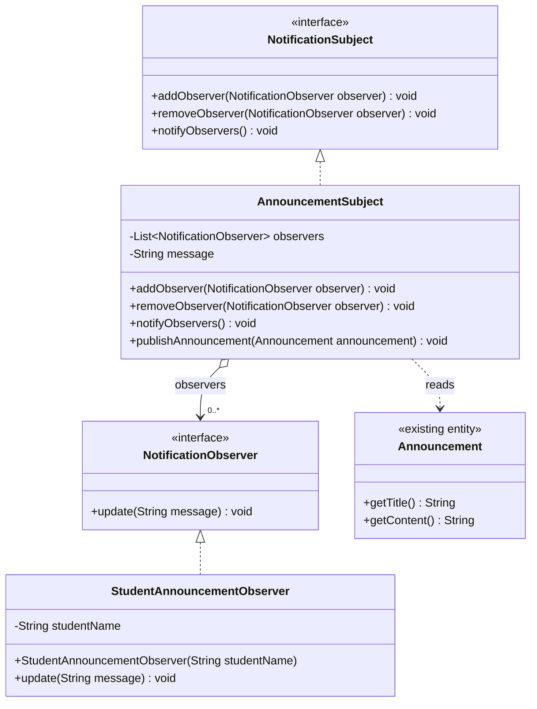

# Observer Pattern: teacher announcements

## Existing project analysis

School360 uses Java 17, Spring Boot 3.2.5, Maven, REST controllers,
JPA entities/repositories, and static HTML/CSS/JavaScript pages. Business workflows
are mainly in controllers; `AILearningService` is the existing service class.

The five candidate use cases exist in the code:

| Candidate | Existing implementation | Assessment |
| --- | --- | --- |
| Examination result publication | `StaffController.toggleReleaseMark()` and `batchReleaseMarks()` update `ExamMark.published`. | Suitable, but individual results require recipient scoping and release/unrelease handling. |
| Enrollment status change | `EnrollmentController.updateStatus()` updates an enrollment request and its student; `StaffController.approveEnrollment()` handles a later decision. | Suitable, but spans multiple approval stages. |
| Library reservation status | `LibraryController.updateReservation()` already saves student notifications for approval/cancellation/rejection. | Suitable, but replacing or supplementing its existing notification logic would affect current behavior. |
| Teacher announcement | `TeacherController.createAnnouncement()` saves an `Announcement`; `StudentController.getAnnouncements()` retrieves announcements in descending ID order. | **Selected:** one event naturally reaches multiple student subscribers. |
| Student support update | `SupportController.updateStatus()` updates tickets; reply/request-info methods already save student notifications. | Suitable, but mixed status/reply events and individual recipients make the example less simple. |

The teacher page posts to `/api/teachers/announcements`; the student page reads
`/api/students/announcements`. The shared JavaScript also has local fallback
handling. All of these existing paths remain unchanged.

## Scope and problem solved

**Design pattern selected: Observer Pattern.** An announcement publisher should
be able to notify multiple subscribers without knowing how each subscriber handles
the message. Subscribers can join or leave without changing the publisher.

This addition demonstrates that behavior using the project's existing `Announcement`
class. It is a standalone, explicitly invoked educational component. It does **not**
automatically observe controller calls, repository saves, browser fallback actions,
or database changes. Console output is the demonstration notification; nothing is
sent to a real student's dashboard or persisted.

Live integration would require an explicit call after successful announcement
persistence, recipient/subscription management, and a delivery implementation.
Those changes are outside this addition because existing functionality must not
be changed. No integration hooks, Spring beans, startup runners, endpoints,
dependencies, authentication changes, or schema changes have been added.

## Pattern participants

| Role | Class/interface | Responsibility |
| --- | --- | --- |
| Subject | `NotificationSubject` | Declares `addObserver`, `removeObserver`, and `notifyObservers`. |
| Observer | `NotificationObserver` | Declares `update(String message)`. |
| ConcreteSubject | `AnnouncementSubject` | Owns the observer list and current message; `publishAnnouncement` reads announcement title/content, sets local state, and notifies subscribers. |
| ConcreteObserver | `StudentAnnouncementObserver` | Implements `update` by displaying the message with a demo student's name. |

The interface declares operations; the concrete subject stores the list because
Java interfaces cannot own per-instance state. The subject depends on the observer
interface, so it does not know the concrete student observer class.

## Files created and explanation of every addition

- `src/main/java/com/school360/pattern/observer/NotificationObserver.java`: required Observer interface.
- `src/main/java/com/school360/pattern/observer/NotificationSubject.java`: required Subject interface.
- `src/main/java/com/school360/pattern/observer/AnnouncementSubject.java`: concrete subject, subscriptions, message state, and synchronous notification loop. It reads but never mutates or saves `Announcement` objects.
- `src/main/java/com/school360/pattern/observer/StudentAnnouncementObserver.java`: concrete observer with console notification handling.
- `src/test/java/com/school360/pattern/observer/AnnouncementObserverDemo.java`: manually runnable example using two in-memory announcements and two subscribers. Keeping its `main` in test sources preserves the application's sole production entry point.
- `docs/observer-pattern.md`: this explanation, class diagram, Mermaid source, and execution instructions.

**Existing files modified: none.** Existing controllers, models, repositories,
services, pages, configuration, and database files are untouched.

## UML class diagram and Mermaid UML code

The Mermaid block below renders the class diagram in Mermaid-capable viewers and
is also the reusable UML source. The existing `Announcement` entity is an input,
not a new Observer participant.



## Simple demonstration

Open `AnnouncementObserverDemo.java` in your IDE and run its `main()` method
with the project's test classpath. It does not start Spring Boot or connect to a
database. With Maven available, `mvn test-compile` compiles the demo; it is a manual
example, not an automatically discovered JUnit test.

1. Create an `AnnouncementSubject`.
2. Register Amali and Nimal using `addObserver()`.
3. Call `publishAnnouncement(first)`; the subject calls `update(message)` on both.
4. Remove Nimal using `removeObserver()`.
5. Call `publishAnnouncement(second)`; only Amali receives the second announcement.

Expected console output:

```text
Amali received: Announcement: Science meeting - Meet in Room 5 at 10 AM.
Nimal received: Announcement: Science meeting - Meet in Room 5 at 10 AM.
Amali received: Announcement: Science meeting update - Please bring your notebook.
```

## Deliberately simple behavior

- Registering the same observer object twice does not duplicate its subscription.
- Removing an absent observer is harmless. Null observers/announcements are rejected.
- Calling `notifyObservers()` before any announcement does nothing.
- A direct later call to `notifyObservers()` repeats the latest message; publishing
  an announcement is an explicit event, not automatic database change detection.
- New subscribers receive future notifications, not an automatic history replay.
- A snapshot of the list is used during delivery. Subscription changes inside a
  callback affect the next notification round.
- Delivery is synchronous and intended for a single-threaded classroom example.
  An exception in an observer propagates to the caller and stops that round.
  There is no background delivery, retry, persistent subscription, or shared
  application-wide instance.

Plain Java classes follow the project's package conventions and need no new
dependencies. The demo student's name is a display label, not an authenticated
identity or a database lookup.
